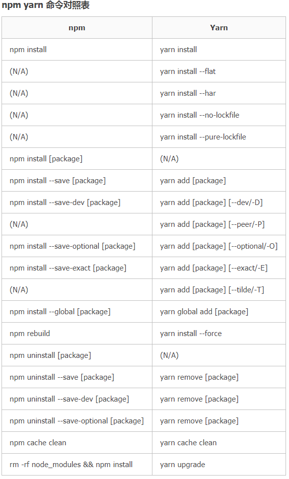

[TOC]

## Node
* 安装[nvm](https://github.com/coreybutler/nvm-windows/releases) 。
切记避免安装到`D:\Program Files `  ，会遇到node找不到的问题
* ```nvm list available```
* `nvm install v8.10.0`
* `nvm install v10.14.0`
* `nvm install v12.16.3`
* `nvm use  v10.14.0`
* `nvm uninstall 10.11.0`

确认node、npm是否安装成功
* node -v
* npm -v

参考文章：
* [Node.js 多版本安装](https://www.cnblogs.com/stevexu/p/9734249.html)
* [nvm安装node出现的问题](https://www.cnblogs.com/beileixinqing/p/6775620.html)

---------

## NPM
* npm 是 Node.js 自带的包管理器，但是默认下载依赖包的地址是国外服务器，下载速度较慢。
* cnpm是淘宝开发的，使用与 npm 一致，默认下载是国内地址，下载速度快得飞起。
* yarn 是 facebook 开发的新一代包管理器，主要是解决依赖包的安装问题。支持离线安装依赖包，同时依赖包的安装顺序不会出错。


### cnpm 安装
```
npm install -g cnpm -registry=https://registry.npm.taobao.org
```

### npm源设置
```

npm config get registry

//官网源
npm config set registry https://registry.npmjs.org

//淘宝源
npm config set registry https://registry.npm.taobao.org

//公司源，公司内的组件需要从这里下载
npm config set registry http://npm.xx.com/
```

### npm和npx差异
* npm是Node.js的软件包管理器，其目标是自动化的依赖性和软件包管理。
这意味着，可以在package.json文件中为项目指定所有依赖项（软件包），当需要为其安装依赖项时，只要运行npm install就可以。
* npx是**执行Node软件包的工具**，它从 npm5.2版本开始，就与npm捆绑在一起。npx的作用：
    * 1.默认情况下，首先检查路径中是否存在要执行的包（即在项目中）；
    * 2.如果存在，它将执行；
    * 3.若不存在，意味着尚未安装该软件包，npx将安装其最新版本，然后执行它；
* npx 等价于 npm install & npm run
* npx 可以加 --no-install 中断其默认行为，意味着告诉npx ，它应该仅执行。如npx some-package --no-install，如果some-package之前未安装，则不安装，仅执行。

**npx优势**：npx让npm包中的命令行工具和其他可执行文件在使用上变得更加简单。它极大地简化了我们之前使用纯粹的npm时所需要的大量步骤。主要特点：
1、临时安装可执行依赖包，**不用全局安装，不用担心长期的污染**。
2、可以执行依赖包中的命令，安装完成自动运行。
3、**自动加载node_modules中依赖包，不用指定$PATH**。
4、可以指定node版本、命令的版本，解决了不同项目使用不同版本的命令的问题。

参考[小tips：npm与npx的区别](https://www.cnblogs.com/moqiutao/p/12920258.html)

---------

## React Demo

```
npm install -g create-react-app
create-react-app antd-demo
npm run start
npm uninstall -g create-react-app
```

```
npx create-react-app antd-demo
npm start
```

```
yarn create react-app antd-demo
yarn start
```

---------

## 常用命令
```
npm install react-scripts@latest
yarn add umi
yarn remove umi
```
